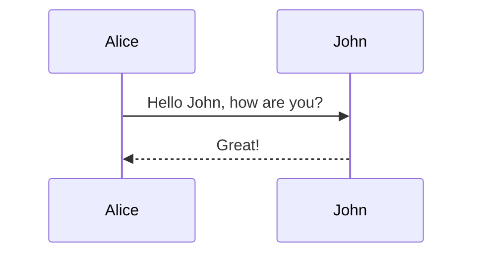

# first title

This is the **first** document

with a small diagrams


<<<

```vegalite
{
  "$schema": "https://vega.github.io/schema/vega-lite/v4.json",
  "width": 500,
  "height": 300,
  "data": {
    "url": "https://vega.github.io/vega-lite/data/us-10m.json",
    "format": {
      "type": "topojson",
      "feature": "counties"
    }
  },
  "transform": [{
    "lookup": "id",
    "from": {
      "data": {
        "url": "https://vega.github.io/vega-lite/data/unemployment.tsv"
      },
      "key": "id",
      "fields": ["rate"]
    }
  }],
  "projection": {
    "type": "albersUsa"
  },
  "mark": "geoshape",
  "encoding": {
    "color": {
      "field": "rate",
      "type": "quantitative"
    }
  }
}
```

next page

END OF TRANSMISSION
